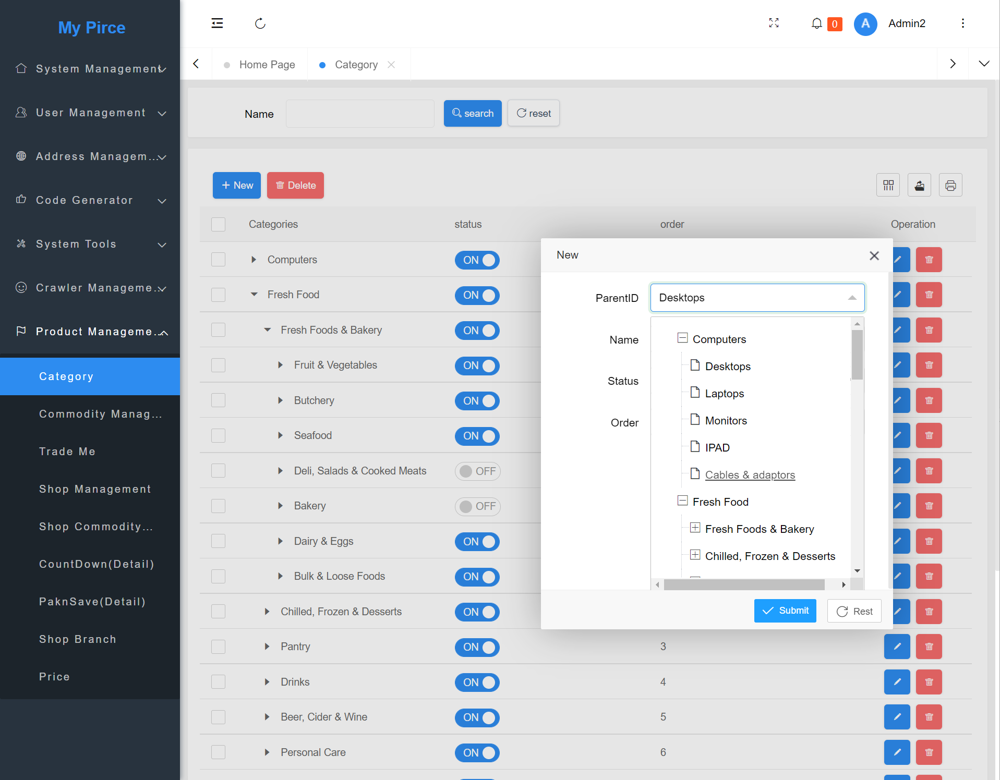
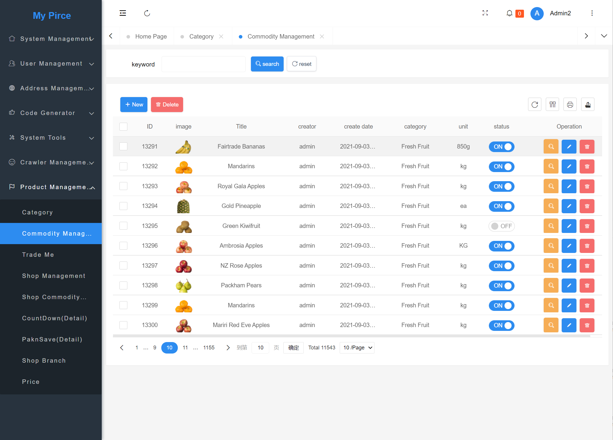
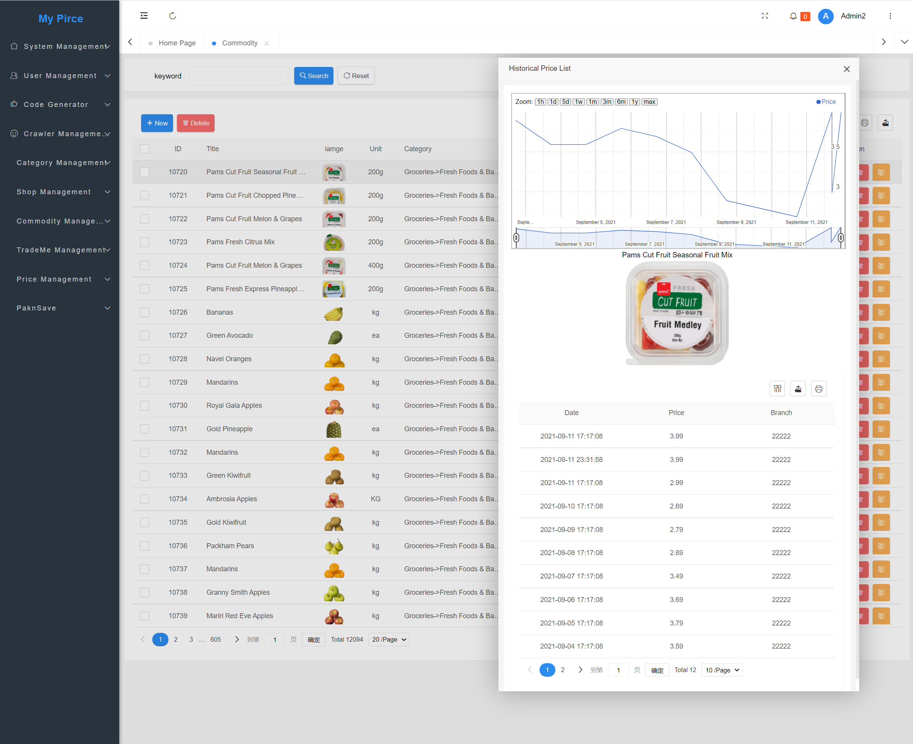
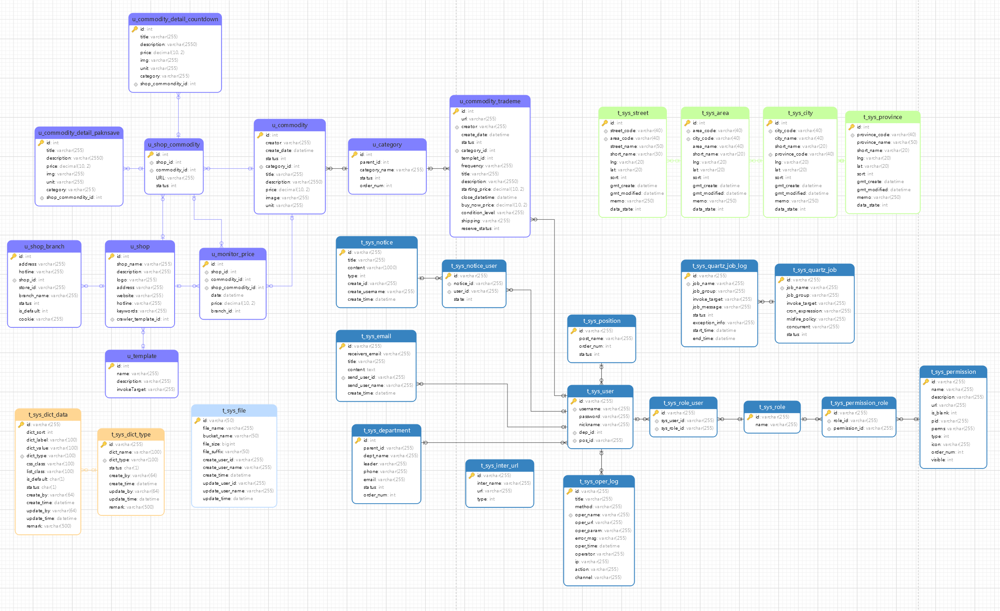

# Price Monitor and Analyse  System ( My Price V1.0) 

- ### **INTRODUCTION**

  This is a personal project. The purpose of this project is to collect price information from various online shopping websites in New Zealand. Also, monitor price information; analyse the price trend of commodities; provide shopping advice. 

  **Discussions on technology, product design, business opportunity,  are big welcome.**

  The project is in progress. It is being upgraded every day. The documents are on the way.

  My Email: shangcong.nz@gmail.com

  

  

  

### Development Environment.
- JDK: 11
- MySQL: 8
- Redis: 6.2
- Eclipse Version: 2021-03 (4.19.0)
- Docker version: 20.10.1
- Maven: 3.6.2
- Testing Operation System: Red Hat Enterprise Linux 7.6
- Version Control : GIT 
- RabbitMQ: 3
- Thymeleaf: 3
- Jenkins: 2.263.1
- Apache Shiro
- MyBatis Generator
- PageHelper
- velocity
- Connection Pool: druid

### Front End

jQuery

LayUI

React

Power BI

### STEP 
1. Import initial database script from  /resource/sql/MyPrice2.sql into your MYSQL database
2. Check MYSQL version. in pom.xml 
3. Check  Database version and database connection address in application-dev.yml.
4. Run Application.java  or WebInitializer.java
### packing to war
-  pom.xml 

## Applications URL

| Application         | URL                               |                                   |
| :------------------ | --------------------------------- | --------------------------------- |
| Home Page           | http://localhost:8080             |                                   |
| Management Platform | http://localhost:8080/admin/login | Username:admin    Password: admin |
|                     |                                   |                                   |
| swagger             | http://localhost:8080/doc.html    |                                   |
|                     |                                   |                                   |

###  Preview:

### 

 

Historical Price

## Database Model

