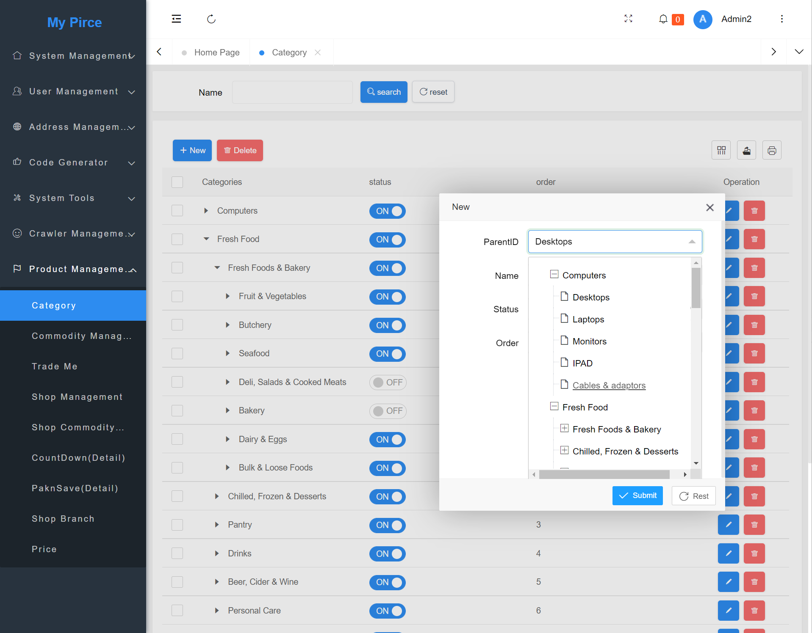
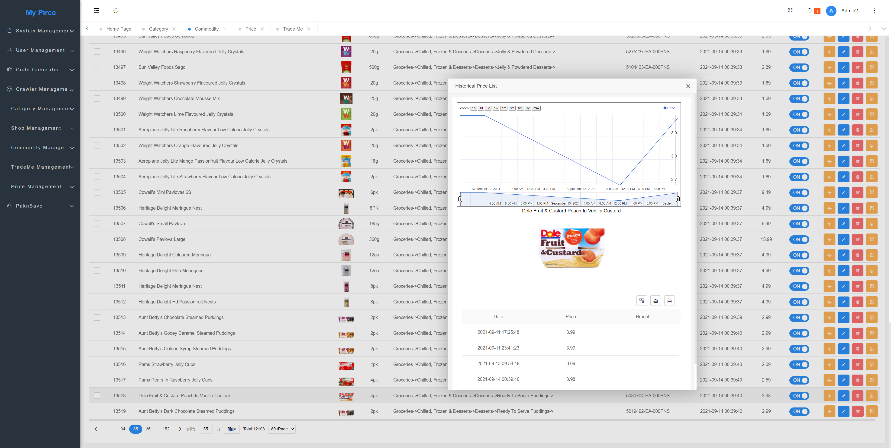
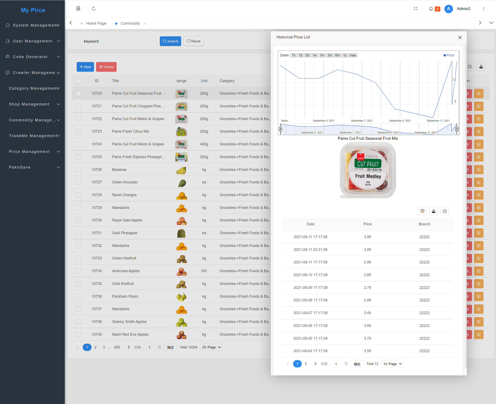
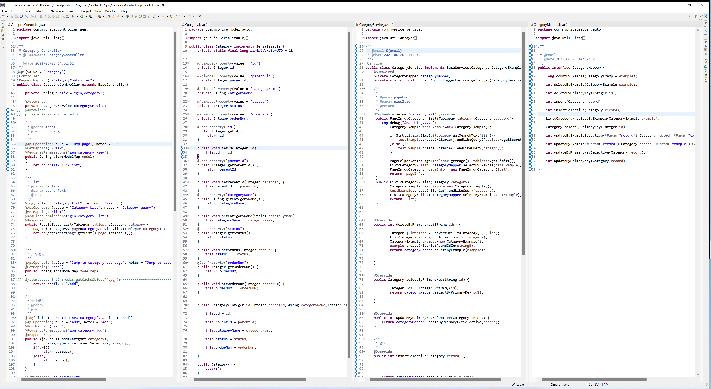

# Price Monitoring and Analysis  System ( My Price V1.0) 

- **INTRODUCTION**

  This is a personal project. The purpose of this project is to collect price information from various online shopping websites in New Zealand. Also, monitor price information; analyse the price trend of commodities; provide shopping advice. 

  **Discussions on technology, product design, business opportunity are big welcome.**

  The project is in progress. It is being upgraded every day. The documents are on the way.

  My Email: shangcong.nz@gmail.com

  

  ****

### Development Environment.
- JDK: 11
- MySQL: 8
- Redis: 6.2
- Eclipse Version: 2021-03 (4.19.0)
- Visual Studio Code version: 1.60
- Operation System (TEST): Red Hat Enterprise Linux 7.6
- Operation System (DEV) : Windows 11
- Docker version: 20.10.1
- XShell version: 7
- Maven: 3.6.2
- Version Control : GIT 
- ~~RabbitMQ: 3~~
- Jenkins: 2.263.1

### Black End

- Spring boot: 2.4.3
- Thymeleaf: 3
- Security: Apache Shiro
- Quartz: 2.3.2
- MyBatis 
- velocity: 1.7
- Connection Pool: druid
- ~~NodeJS: 14.16~~

### Front End

- JQuery

- LayUI

- React

- Google Chart

- [x] ~~Power BI~~

### STEP 
1. Import initial database script from  /doc/06_Maintenance/01_Initial Data/MyPrice.sql into your MYSQL database
2. Check MYSQL version. in pom.xml 
3. Check  Database version and database connection address in application-dev.yml.
4. Run Application.java  or WebInitializer.java
### packing to war
-  pom.xml 

## Applications URL

| Application         | URL                               |                                   |
| :------------------ | --------------------------------- | --------------------------------- |
| Home Page           | http://localhost:8080             |                                   |
| Management Platform | http://localhost:8080/admin/login | Username:admin    Password: admin |
| swagger             | http://localhost:8080/doc.html    |                                   |

###  Preview:

### 

 

Historical Price

## Database Model

Code Style

